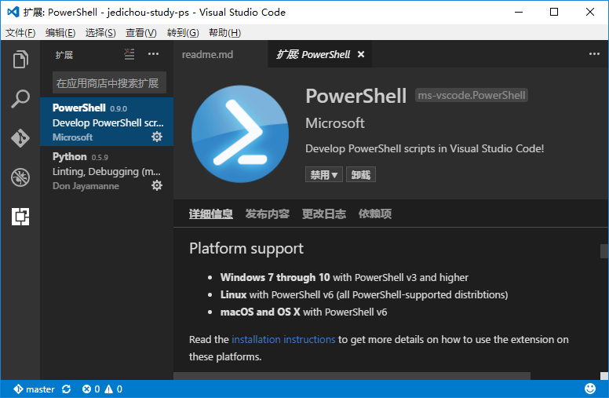
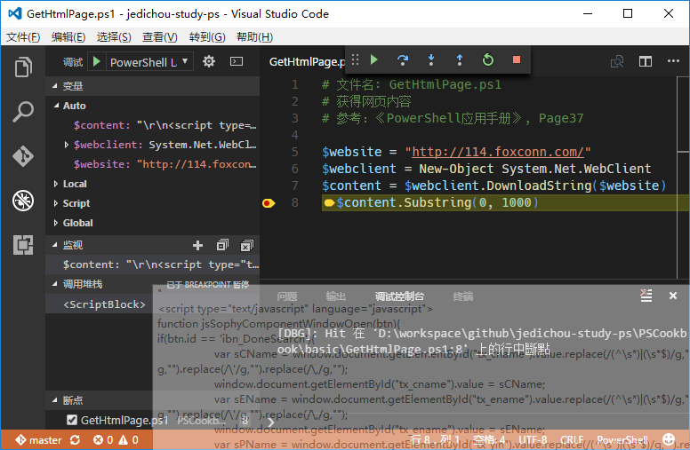

用Visual Studio Code进行调试
==========================

* 安装PowerShell的插件；
* 打开代码，切换到调试模式；
* 按*F5*点击配置会自动产生一个调试配置文件；
* 打上断点调试开了；

### Visual Studio Code的插件
插件介绍是这个样子的（注意在Windows上PowerShell要求3.0以上）。  

### 调试时候的样子
例子举的太简单了哈。  
